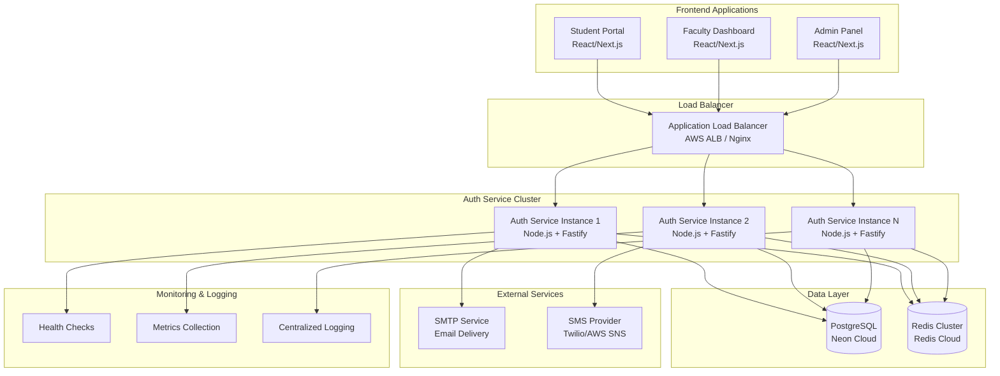
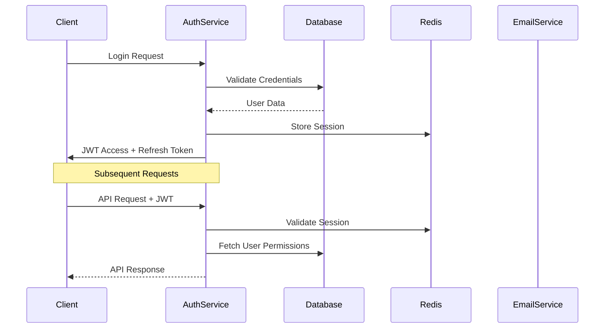
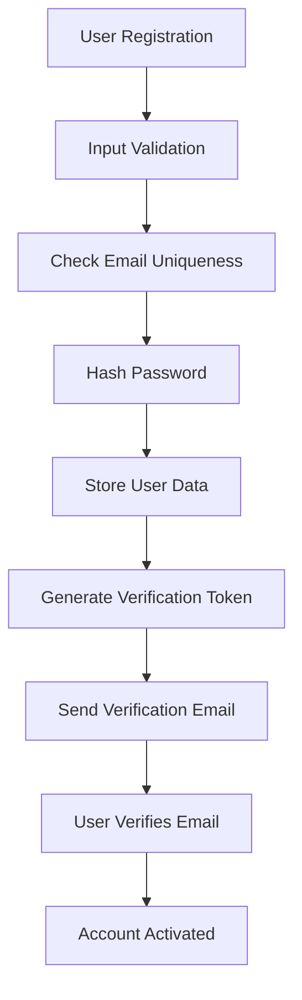
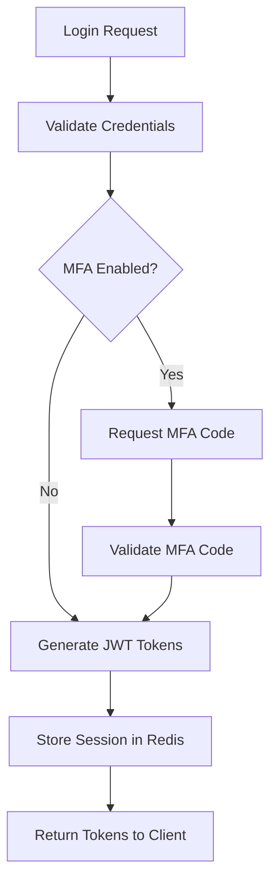
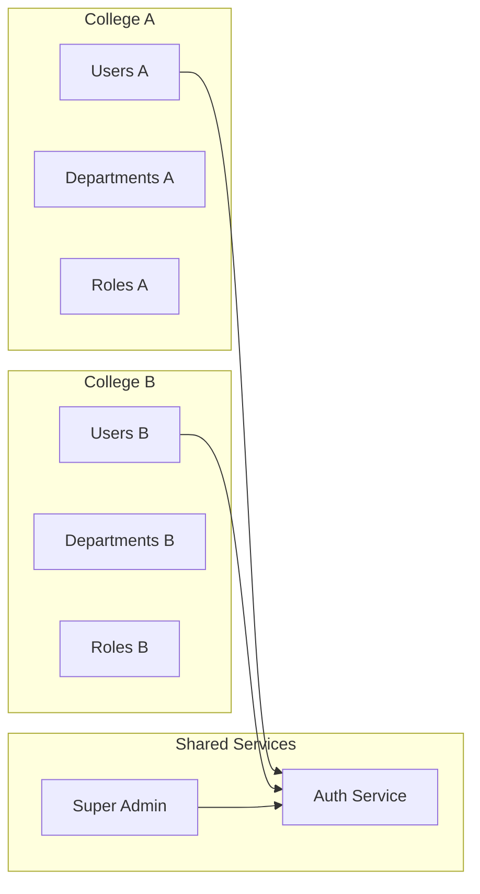

# System Architecture

## 🏗️ Overview

The Nexus Auth Service is a microservice-based authentication and authorization system designed for educational institutions. It provides secure, scalable authentication for students, faculty, and administrators across multiple colleges.

## 📊 Architecture Diagram



## 🎯 Core Services

### 1. Authentication Service (Primary)
- **Technology**: Node.js 20 + Fastify + TypeScript
- **Purpose**: Handle all authentication and authorization
- **Features**:
  - JWT token generation and validation
  - Multi-factor authentication (TOTP, SMS, Backup codes)
  - Password management and reset
  - Session management
  - Role-based access control (RBAC)

### 2. Database Layer
- **Primary Database**: PostgreSQL (Neon Cloud)
  - User profiles and credentials
  - College/institution data
  - Audit logs and security events
  - JWT key rotation history
- **Cache Layer**: Redis Cluster
  - Session storage
  - Rate limiting counters
  - Temporary tokens (email verification, password reset)
  - API response caching

### 3. External Integrations
- **Email Service**: SMTP for notifications
- **SMS Service**: For MFA and notifications
- **File Storage**: For profile pictures and documents

## 🔐 Security Architecture

### Authentication Flow


### Security Layers
1. **Network Security**
   - HTTPS/TLS encryption
   - CORS configuration
   - Rate limiting per IP/user

2. **Application Security**
   - Input validation with Zod schemas
   - SQL injection prevention (Prisma ORM)
   - XSS protection with Helmet.js
   - CSRF protection

3. **Authentication Security**
   - JWT with RS256 signing
   - Automatic key rotation
   - Refresh token rotation
   - Multi-factor authentication

4. **Authorization Security**
   - Role-based access control
   - Resource-level permissions
   - API endpoint protection

## 📊 Data Flow

### User Registration Flow


### Authentication Flow


## 🚀 Scalability Design

### Horizontal Scaling
- **Stateless Services**: All auth service instances are stateless
- **Session Storage**: Redis cluster for distributed session management
- **Database**: Read replicas for improved performance
- **Load Balancing**: Application Load Balancer with health checks

### Performance Optimizations
- **Caching Strategy**:
  - Redis for session data
  - Application-level caching for static data
  - Database query optimization with indexes
- **Connection Pooling**: Prisma connection pooling
- **Async Processing**: Background jobs for email/SMS

### Monitoring & Observability
- **Health Checks**: `/health` endpoint for load balancer
- **Metrics**: Custom metrics for authentication events
- **Logging**: Structured logging with correlation IDs
- **Alerts**: Automated alerts for security events

## 🏢 Multi-College Architecture

### College Isolation


### Role Hierarchy
```
SUPER_ADMIN (Global)
├── HEAD_ADMIN (College-wide)
│   ├── DEPT_ADMIN (Department-level)
│   ├── PLACEMENTS_ADMIN (Placements)
│   └── FACULTY (Teaching staff)
└── STUDENT (Enrolled students)
```

## 🔄 Service Communication

### Internal APIs
- **Health Checks**: Service health monitoring
- **Metrics Collection**: Performance and usage metrics
- **Audit Events**: Security and compliance logging

### External APIs
- **Frontend Integration**: RESTful APIs with JWT authentication
- **Third-party Services**: Email, SMS, and notification services

## 📈 Performance Characteristics

### Expected Load (10M+ Users)
- **Concurrent Users**: 100,000+
- **Requests per Second**: 10,000+
- **Response Time**: <200ms (95th percentile)
- **Availability**: 99.9% uptime

### Resource Requirements
- **CPU**: 2-4 cores per instance
- **Memory**: 2-4GB per instance
- **Database**: 100+ connections
- **Redis**: 1GB+ memory for sessions

## 🛡️ Security Considerations

### Data Protection
- **Encryption at Rest**: Database encryption
- **Encryption in Transit**: TLS 1.3
- **Password Security**: Argon2 hashing
- **Token Security**: JWT with short expiration

### Compliance
- **Audit Logging**: All authentication events
- **Data Privacy**: GDPR-compliant data handling
- **Security Headers**: OWASP recommended headers
- **Rate Limiting**: DDoS and brute-force protection

## 🔧 Technology Stack

### Backend
- **Runtime**: Node.js 20 LTS
- **Framework**: Fastify 4.x
- **Language**: TypeScript 5.x
- **ORM**: Prisma 5.x
- **Validation**: Zod schemas

### Database & Cache
- **Database**: PostgreSQL 15+
- **Cache**: Redis 7+
- **Connection Pooling**: Prisma connection pooling

### Security & Monitoring
- **Authentication**: JWT (RS256)
- **Security**: Helmet.js, CORS, Rate limiting
- **Monitoring**: Custom health checks and metrics
- **Logging**: Pino structured logging

### Infrastructure
- **Containerization**: Docker with multi-stage builds
- **Orchestration**: Kubernetes ready
- **Cloud**: AWS/Azure/GCP compatible
- **CI/CD**: GitHub Actions ready

---

This architecture is designed to be:
- **Scalable**: Handle millions of users
- **Secure**: Enterprise-grade security
- **Maintainable**: Clean code and documentation
- **Observable**: Comprehensive monitoring
- **Resilient**: Fault-tolerant design
